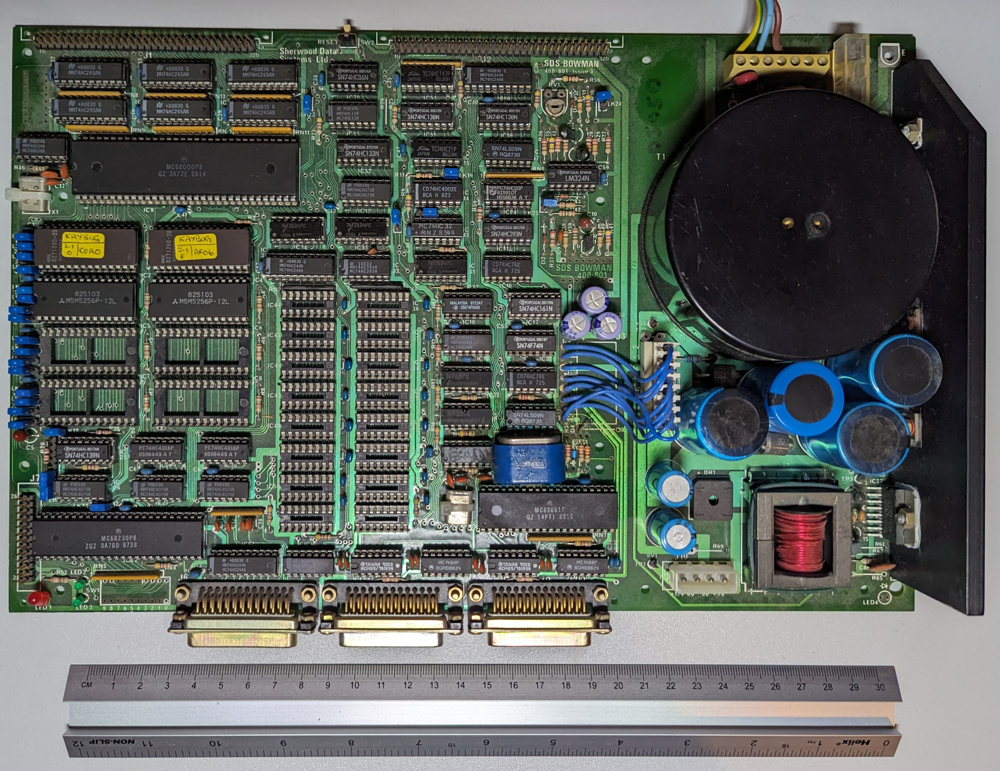

># The Sherwood Bowman 68000 Single Board Computer

The Sherwood Data Systems Bowman was a 68000-based single-board
computer from the 1980s.

It's pretty obscure; I could find very little about it on the
internet, so I decided to document it. This repo contains scans of the
manuals I have, and the EPROM monitor it runs.

I *did* however, manage to find an advert for it, to give you an idea
of the context:

(Taken from
[https://www.worldradiohistory.com/UK/Wireless-World/90s/Wireless-World-1990-11.pdf](https://www.worldradiohistory.com/UK/Wireless-World/90s/Wireless-World-1990-11.pdf)).

## Background

In 1995, I had a summer job working at MRG Systems in Stroud, UK. They
developed teletext systems and display systems used in betting
shops. I believe their custom hardware was 68k-based. At the end of my
job, I rather cheekily asked if they had any old, unused hardware
going spare, and thus managed to score this (then obsolete) board.

According to the silkscreen, it's a 400.801, Issue 3.

I had some fun working with 68K assembly, and cross-assembling for it,
with the aim of producing a very basic LISP (a language I was rather
interested in, at the time).

I find it a little interesting/scary, since it's a single unenclosed
PCB with a mains PSU and all the logic on the same board. While the
12V to 5V step-down is switch-mode, the main power supply is linear,
so it's got this huuuge transformer slapped onto one end of a chunky
PCB. It's a crazy design!

## Contents

The board came supplied with a "Kaybug" monitor (which at least has a
few more hits on Google). When I received the board, it came with
three manuals - one for the board itself, and two for two different
versions of Kaybug. The board manual includes schematics on fold-out
A3 sheets. I've organised this content into the repo as follows:

 * [bowman](./bowman) - A scan of the main manuals, minus the
   schematics.
 * [schematics](./schematics) - Photos of the Bowman's schematics.
 * [kaybug-1.0](./kaybug-1.0) - A scan of the Kaybug version 1.0
   manual.
 * [kaybug-3.1](./kaybug-3.1) - A scan of the Kaybug version 3.1
   manual.
 * [dumps](./dumps) - Contains the EPROM dumps of Kaybug 3.1.

You may think that the Bowman's schematics, as a set of photos, aren't
great quality, and scanning and stitching would be better. I did take
some scans, but gave up before stitching, as the photocopies in the
manual just aren't very good. All those hand-written identifiers still
look really bad, whether they're scanned or photographed.

## Hardware notes

To me, the board looks pretty fully-featured, and doesn't cut corners
on optional features - supporting external DTACK (with bus timeout),
and vectored interrupts, a watchdog timer and power failure
circuitry. The external bus access lines are properly
buffered. There's battery-backed RAM. Plenty of jumpers for
configurability. It feels "well-engineered" and rather unlike the "if
in doubt, leave it out" kind of design I've seen with some other 68K
designs, such as the early Macs (with their Woz-style minimisation).

AFAICT, not all components are properly identified on the schematic,
the default jumper configuration isn't clear, and the circuit
descriptions in the manual leave you flipping back and forth through
the schematics to find the relevant circuit.

It's fun to see that the demuxing of the address bus into RAS and CAS
is done for odd and even bits of the address bus, rather than low and
high parts. I hadn't really thought before about how this is a
perfectly valid way to do it (and necessary to support different DRAM
sizes)!

I'm thinking of building my own 68000 board with DRAM, so it was
interesting to see how simply the RAS/CAS and refresh circuitry are
implemented, even if this is because they use DTACK rather than try to
squeeze between memory accesses. Not a PAL or GAL in sight.

## Software notes

The `dumps` directory contains the raw dumps of the odd and even byte
EPROMs, plus "`combined.bin`", which interleaves them to create the
actual memory image seen by the CPU.

The directory also contains an exported Ghidra project (from version
10.1.3), and text disassembly export for this ROM. I have done my best
not to fall down the rabbit hole of trying to reverse this image,
tempting thought it is - it looks like it should be pretty
straightforward to pull apart, with function pointer tables for the
system calls, monitor commands and what I think is the assembler
opcodes.

I was surprised to see references to files names like
"../kasm_main.c", suggesting the assembler was cross-compiled from
some kind of Unix, which would be a pretty chunky (but not unheard of)
development environment for people developing micro software in the
'80s.

## Board state

I'm including photos of the [front](./front.jpg) and
[back](./back.jpg) of the board. You can see the large transformers
and caps associated with the unenclosed linear PSU. You can also see
the empty sockets for DRAM - I thought this board came with DRAM
installed, but apparently I only had the SRAM (you can see the two
chips of the EPROM monitor, and two chips of SRAM. The other banks are
empty).

If you have slightly more eagle eyes, you will spot that the backup
battery is slightly fuzzy. D'oh! Sometime in the last couple of
decades, it started to leak. I have promptly snipped it off the board
and disposed of it (it's not vital to the functionality). Inspecting
the area left behind, it doesn't look like it's too badly damaged. I'm
grateful that all the ICs are socketed, making investigation and
fix-ups easier.
